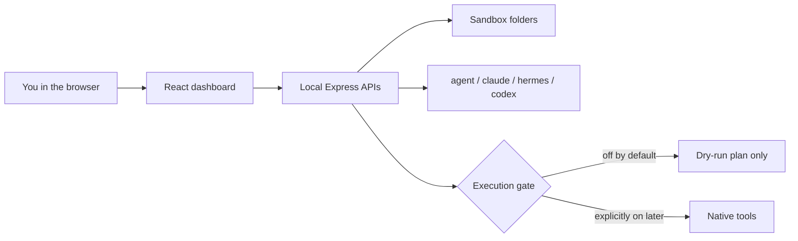

<h1 align="center">Agent OS</h1>

<p align="center">
  <strong>A local command center for AI coding agents.</strong><br />
  Clone it. Run it on your machine. Dry-run by default. Execution stays off until you turn it on.
</p>

<p align="center">
  <a href="https://hharsha98.github.io/agent-os/"></a>
  <a href="#run-it-locally"></a>
  
</p>

<p align="center">
  <a href="https://hharsha98.github.io/agent-os/">Static gallery</a>
  ·
  <a href="docs/DEMO.md">Product tour</a>
  ·
  <a href="docs/V1.md">What v1 includes</a>
  ·
  <a href="SETUP-GUIDE.md">Setup guide</a>
</p>

---

## What this is

Agent OS is a **local-first dashboard** for agents that already live on a developer machine: Cursor Agent, Claude Code, Codex, and Hermes.

It is **not** a hosted multi-tenant cloud app. The github.io page is a **static gallery**, suitable later for an `os.` subdomain, not the running product.

An optional **public gallery** (`DEMO_PUBLIC=1`) simulates agents and labels them **Demo**. The Contabo production path leaves that flag off and uses the live lane (`AGENT_OS_LIVE_CHAT=1`) so chat and missions call OmniRoute, Hermes, and OpenClaw. See [docs/FULL-PRODUCT-PLAN.md](docs/FULL-PRODUCT-PLAN.md).

| You see | What it means |
| --- | --- |
| Mission Control | Real CLI probes. A binary on PATH is not a connected chat session. |
| Unified Chat labeled **Dry run** / **API preview** / **chat not wired** | Safety is visible in the UI. Cursor is not faked. |
| Workspace sandbox | Preview is jailed to `~/.hermes-agent-os/workspace` and `exports`. |
| Machine Control with **Run command disabled** | Computer-control stays gated. |
| Honest **Not configured** tiles | Studio image/voice/music and missing keys stay missing. |

---

## Local v1 in one pass

1. Open **Mission Control**. Read CLI / dashboard chat / live-execution for each agent.
2. Open **Unified Chat**. Send a dry-run. Cursor stays unwired; Claude/Hermes plan; Codex can preview if a local key exists.
3. Keep `HERMES_AGENT_OS_ENABLE_EXEC=0` unless you later decide to enable live tools.



**Stack:** React 18 + TypeScript + Vite on the front. Node / Express on the back. Tests with Node’s built-in test runner.

---

## Feature status (honest)

| Surface | State |
| --- | --- |
| Mission Control (default landing) | Live local CLI + chat-capability checks |
| Unified Chat | Dry-run for Claude / Hermes; Codex API preview when a key is saved; Cursor CLI detected, chat not routed |
| Workspace preview | Live, sandboxed; Loop briefings in `loop/` |
| Workflow studio / Agent Builder + AI APIs | Wired; Codex generation needs a local key; native runs gated |
| Goals / Kanban / Memory / Notebook / Journal / Loop | Live local stores |
| Capability map | Live/partial/missing checklist for this machine |
| Studio | Honest **Not configured / Parked** except local video tools when present |
| Machine Control | Status only — no send/run |
| OpenClaw | Detected if installed; not faked |
| Overnight Goal Mode | Optional; **execution stays off** by default |
| Public gallery (`DEMO_PUBLIC=1`) | Simulated Mission Control, Chat timeline, Workspace notes, gated machine preview, local canvas |
| Live operator (`AGENT_OS_LIVE_CHAT=1`, gallery off) | OmniRoute chat, OpenClaw gateway HTTP, native CLIs when the execution gate and binaries exist |
| Hosted multi-tenant SaaS | **Not this product** |

---

## Run it locally

Needs **Node 18+**. This is a local app.

```bash
git clone https://github.com/hharsha98/agent-os.git
cd agent-os
cp .env.example .env
npm ci
npm run build
npm start
```

Open [http://127.0.0.1:8090](http://127.0.0.1:8090). The process binds `0.0.0.0` so a reverse proxy on the same machine can reach it. `PORT` overrides 8090. `GET /api/health` reports `ok`, `bind`, and `port`.

The server loads `.env` at startup and **does not override** variables already in the process environment. `.env` is optional if you only want the dry-run dashboard.

Hot reload while hacking:

```bash
npm run dev
```

That serves the Vite UI on [http://127.0.0.1:5173](http://127.0.0.1:5173) and proxies `/api` to port **8090** (or `PORT` from the process environment / `.env`).

Leave these **off** unless you later decide otherwise (already `0` in `.env.example`):

```bash
HERMES_AGENT_OS_ENABLE_EXEC=0
HERMES_AGENT_OS_ENABLE_INSTALL=0
HERMES_AGENT_OS_PUBLIC_MODE=0
```

`.env` is gitignored. Never commit API keys.

---

## Verify (no Docker required)

```bash
npm run build
env -u HERMES_HOME npm test
npm start   # in one terminal
npm run smoke:local
```

`smoke:local` hits health, Mission Control product status, Unified Chat dry-run plans, workspace, and the execution gate. **CI uses this native path** — Docker is never required to verify or ship.

Public demo checks (also in CI, still no Docker):

```bash
npm run smoke:public
```

That boots a temporary server with `DEMO_PUBLIC=1` and asserts the simulated fleet, chat plan, timeline note, workspace seed, gated machine preview, and local canvas.

Live-lane checks (no real keys, no Docker):

```bash
npm run smoke:live
```

That boots with `AGENT_OS_LIVE_CHAT=1` and `DEMO_PUBLIC=0`, then checks `/api/live/status`, a dry-run plan, and that a live Hermes turn is not a canned Demo reply.

---

## Contabo live operator

Production on the VPS is **not** `DEMO_PUBLIC=1`. That flag is only the canned gallery.

```bash
# /etc/agent-os/live.env — placeholders are in deploy/live.env.example
DEMO_PUBLIC=0
AGENT_OS_LIVE_CHAT=1
HERMES_AGENT_OS_ENABLE_EXEC=1
HERMES_AGENT_OS_REQUIRE_AUTH=1
OMNIROUTE_BASE_URL=https://omniroute.example/v1
OMNIROUTE_API_KEY=...
OPENCLAW_GATEWAY_URL=http://127.0.0.1:18789/v1
OPENCLAW_GATEWAY_TOKEN=...
HERMES_HOME=~/.hermes
```

Run the unit as the Unix user that owns `HERMES_HOME` and can reach the OpenClaw gateway. Example unit: `deploy/agent-os-live.service`. Caddy still proxies `127.0.0.1:8090`.

What OmniRoute can do without a local CLI: labeled chat and mission text. What still needs the machine: `hermes` (tools, Kanban, gateway restart), `openclaw` or `openclaw-gateway` with chat completions enabled, and `agent` / `claude` / `codex` for native edits. Machine Control does not grow a public shell.

```bash
npm run smoke:live
```

## Public gallery / optional demo

`DEMO_PUBLIC=1` is a **sandboxed walkthrough**, not a claim that anyone’s Claude, Cursor, Codex, or Hermes is connected. The badge is **Public demo · sandboxed**. Do not use it for the Contabo host that should call OmniRoute.

What a stranger can do at a URL like `https://agentos.169.58.185.43.sslip.io/`:

1. **Mission Control** — simulated agents labeled **Demo**, with the host CLI called out separately when it exists.
2. **Unified Chat** — a multi-step plan, then **Run simulated timeline**, which writes `demo/latest-timeline.md`.
3. **Workspace** — seeded briefing plus a note composer (`.md` / `.txt` / `.html` inside the sandbox only).
4. **Machine Control** — canned transcripts only. **Run command** stays disabled. Arbitrary shell is refused.
5. **Demo canvas** — local workflow graph. Convex and Clerk are not required.

While `DEMO_PUBLIC=1`, live execution stays locked even if `HERMES_AGENT_OS_ENABLE_EXEC=1`. Leave `HERMES_AGENT_OS_PUBLIC_MODE=0` for an open demo. That flag is an admin lock, not the demo switch. If you set it, visitors need `HERMES_AGENT_OS_ADMIN_TOKEN`.

```bash
npm ci
npm run build
DEMO_PUBLIC=1 PORT=8090 npm start
```

Suggested layout on one Contabo VPS: Node listens on `127.0.0.1:8090` (`HOST=127.0.0.1`), Caddy terminates TLS and proxies the sslip.io name. The app default bind is `0.0.0.0` when `HOST` is unset. Full unit, env file, and Caddy example: [docs/HANDOFF-CONTABO.md](docs/HANDOFF-CONTABO.md).

```bash
npm run smoke:public
# against a server you already started:
BASE_URL=http://127.0.0.1:8090 npm run smoke:public
```

The workspace on that host is **shared**. Do not paste secrets into notes.

## Optional: Docker on your Mac

Only if you already have Docker Desktop and prefer a containerized dashboard process:

```bash
cp .env.example .env
docker compose up --build
```

Host port **8090**. Host-installed CLIs (`agent`, `claude`, `hermes`, `codex`) are **not** injected into the container. Prefer the native `npm start` path for demos that need CLI probes.


---

## Why the safety story matters

Most agent dashboards look impressive and then silently run shell. This one is built the other way around:

1. Show what is actually installed.
2. Let you plan in **dry-run**.
3. Keep computer-control, installs, and public mode behind explicit flags.
4. Preview generated files only inside a sandbox.

---

## Repo map

```text
src/                 Dashboard (Mission Control, Chat, Phase 2 pages)
server/              Express APIs, workspace sandbox, memory, goals
test/                Runtime + workspace + local-agent tests
scripts/local-smoke.js   Native smoke (no Docker)
docs/                Static gallery and product tour
.env.example         Safe defaults — copy to .env
```

---

<p align="center">
  <sub>Local-first · MIT · <a href="https://github.com/hharsha98/agent-os">hharsha98/agent-os</a></sub>
</p>
