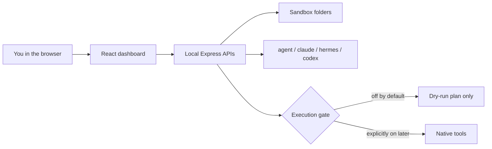

<h1 align="center">Agent OS</h1>

<p align="center">
  <strong>A local command center for the coding agents already on your machine.</strong><br />
  Clone it. Run it. It stays on 127.0.0.1. Dry-run by default. Execution stays off until you turn it on.
</p>

<p align="center">
  <a href="https://hharsha98.github.io/agent-os/"></a>
  <a href="#run-it-locally"></a>
  
</p>

<p align="center">
  <a href="https://hharsha98.github.io/agent-os/">Static gallery</a>
  ·
  <a href="docs/DEMO.md">Product tour</a>
  ·
  <a href="docs/V1.md">What v1 includes</a>
  ·
  <a href="docs/HOSTING.md">Hosting</a>
  ·
  <a href="SETUP-GUIDE.md">Setup guide</a>
</p>

---

## What this is

Agent OS is a **local operator dashboard** for Cursor Agent, Claude Code, Codex, and Hermes.

You install it like a local app: clone, build, open a browser on the same machine. There is no public Live URL. **AgentOps Studio** is the hosted ops product. This repository is not that product.

The [static gallery](https://hharsha98.github.io/agent-os/) is screenshots. It does not run agents.

A desktop shell is not in this release. Node on your machine is the v1 install.

---

## Run it locally

Needs **Node 18+**.

```bash
git clone https://github.com/hharsha98/agent-os.git
cd agent-os
cp .env.example .env
npm ci
npm run build
npm start
```

Open [http://127.0.0.1:8090](http://127.0.0.1:8090).

The server binds **127.0.0.1** unless you set `HOST`. `.env.example` sets that explicitly. `PORT` overrides 8090. `GET /api/health` reports `ok`, `bind`, and `port`.

`.env` is optional for a dry-run dashboard. The server loads it at startup and **does not override** variables already in the process environment. `.env` is gitignored. Never commit API keys.

These stay **off** in `.env.example`:

```bash
HERMES_AGENT_OS_ENABLE_EXEC=0
HERMES_AGENT_OS_ENABLE_INSTALL=0
HERMES_AGENT_OS_PUBLIC_MODE=0
DEMO_PUBLIC=0
AGENT_OS_LIVE_CHAT=0
```

Hot reload while hacking:

```bash
npm run dev
```

That serves the Vite UI on [http://127.0.0.1:5173](http://127.0.0.1:5173) and proxies `/api` to port **8090**.

---

## Honest limits

| You see | What it means |
| --- | --- |
| Mission Control | Real CLI probes. A binary on PATH is not a connected chat session. |
| Unified Chat labeled **Dry run** / **API preview** / **chat not wired** | Safety is visible in the UI. Cursor is not faked. |
| Workspace sandbox | Preview is jailed to `~/.hermes-agent-os/workspace` and `exports`. |
| Machine Control with **Run command disabled** | Computer-control stays gated. |
| Honest **Not configured** tiles | Studio image/voice/music and missing keys stay missing. |
| Static gallery | Screenshots on github.io. Not the running app. |
| `DEMO_PUBLIC=1` | Optional local simulation for screenshots. Not a public host. |
| Live operator lane | For the owner of this machine. Localhost, or a private host behind SSH. |
| Hosted multi-tenant Live | **Out of scope.** |
| Public Contabo site | **Retired.** Do not treat any old hostname as a product URL. |



**Stack:** React 18 + TypeScript + Vite on the front. Node / Express on the back. Tests with Node’s built-in test runner.

### Feature status

| Surface | State |
| --- | --- |
| Mission Control (default landing) | Live local CLI + chat-capability checks |
| Unified Chat | Dry-run for Claude / Hermes; Codex API preview when a key is saved; Cursor CLI detected, chat not routed |
| Workspace preview | Live, sandboxed; Loop briefings in `loop/` |
| Workflow studio / Agent Builder + AI APIs | Wired; Codex generation needs a local key; native runs gated |
| Goals / Kanban / Memory / Notebook / Journal / Loop | Live local stores |
| Capability map | Live/partial/missing checklist for this machine |
| Studio | Honest **Not configured / Parked** except local video tools when present |
| Machine Control | Status only — no send/run |
| OpenClaw | Detected if installed; not faked |
| Overnight Goal Mode | Optional; **execution stays off** by default |
| Screenshot gallery (`DEMO_PUBLIC=1`) | Simulated Mission Control, Chat timeline, Workspace notes, gated machine preview, local canvas |
| Live operator (`AGENT_OS_LIVE_CHAT=1`, gallery off) | OmniRoute chat, OpenClaw gateway HTTP, native CLIs when the execution gate and binaries exist |
| Desktop installer | Not in v1 |
| Hosted multi-tenant SaaS | **Not this product** |

On a fresh clone: open Mission Control, send one Unified Chat dry-run, and leave `HERMES_AGENT_OS_ENABLE_EXEC=0`.

---

## Verify

```bash
npm run build
env -u HERMES_HOME npm test
npm start   # in one terminal
npm run smoke:local
```

`smoke:local` hits health, Mission Control product status, Unified Chat dry-run plans, workspace, and the execution gate. **CI uses this native path.** Docker is not required.

Screenshot-gallery checks (local process, still no Docker):

```bash
npm run smoke:public
```

That boots a temporary server with `DEMO_PUBLIC=1` and asserts the simulated fleet, chat plan, timeline note, workspace seed, gated machine preview, and local canvas.

Live-lane checks (no real keys, no Docker):

```bash
npm run smoke:live
```

That boots with `AGENT_OS_LIVE_CHAT=1` and `DEMO_PUBLIC=0`, then checks `/api/live/status`, a dry-run plan, and that a live Hermes turn is not a canned Demo reply.

---

## Optional screenshot gallery

`DEMO_PUBLIC=1` is a **local sandboxed walkthrough** for screenshots. It is not a claim that anyone’s Claude, Cursor, Codex, or Hermes is connected. The badge is **Public demo · sandboxed**. While it is on, live execution stays locked even if `HERMES_AGENT_OS_ENABLE_EXEC=1`.

What it simulates, on your own machine:

1. **Mission Control** — agents labeled **Demo**, with the host CLI called out separately when it exists.
2. **Unified Chat** — a multi-step plan, then **Run simulated timeline**, which writes `demo/latest-timeline.md`.
3. **Workspace** — seeded briefing plus a note composer (`.md` / `.txt` / `.html` inside the sandbox only).
4. **Machine Control** — canned transcripts only. **Run command** stays disabled.
5. **Demo canvas** — local workflow graph. Convex and Clerk are not required.

```bash
DEMO_PUBLIC=1 HOST=127.0.0.1 PORT=8090 npm start
```

`HERMES_AGENT_OS_PUBLIC_MODE` is an admin lock, not the gallery switch. Leave it at `0`.

Do not publish this process. The workspace is one shared sandbox for whoever can open it.

---

## Private self-host

Keep the app on loopback. If you need it from another machine, use an SSH tunnel. Public Internet exposure is discouraged. Auth is required if you ever reverse-proxy it.

The old public Contabo Caddy site was removed. Details, the tunnel command, and the optional private systemd unit: [docs/HOSTING.md](docs/HOSTING.md). Product form: [docs/FULL-PRODUCT-PLAN.md](docs/FULL-PRODUCT-PLAN.md).

---

## Optional: Docker

Only if you already have Docker and want a containerized dashboard process:

```bash
cp .env.example .env
docker compose up --build
```

The host port is **127.0.0.1:8090**. Inside the container the process uses `HOST=0.0.0.0` so Docker can forward that port. Host-installed CLIs (`agent`, `claude`, `hermes`, `codex`) are **not** injected into the container. Prefer `npm start` when you want CLI probes.

---

## Why the safety story matters

Most agent dashboards look impressive and then silently run shell. This one is built the other way around:

1. Show what is actually installed.
2. Let you plan in **dry-run**.
3. Keep computer-control, installs, and public mode behind explicit flags.
4. Preview generated files only inside a sandbox.
5. Stay on localhost unless you deliberately tunnel or proxy it.

---

## Repo map

```text
src/                 Dashboard (Mission Control, Chat, Phase 2 pages)
server/              Express APIs, workspace sandbox, memory, goals
test/                Runtime + workspace + local-agent tests
scripts/local-smoke.js   Native smoke (no Docker)
docs/                Static gallery, product tour, hosting, product plan
.env.example         Safe defaults — copy to .env
deploy/              Optional private loopback unit, not a public site
```

---

<p align="center">
  <sub>Local-first · MIT · <a href="https://github.com/hharsha98/agent-os">hharsha98/agent-os</a></sub>
</p>
