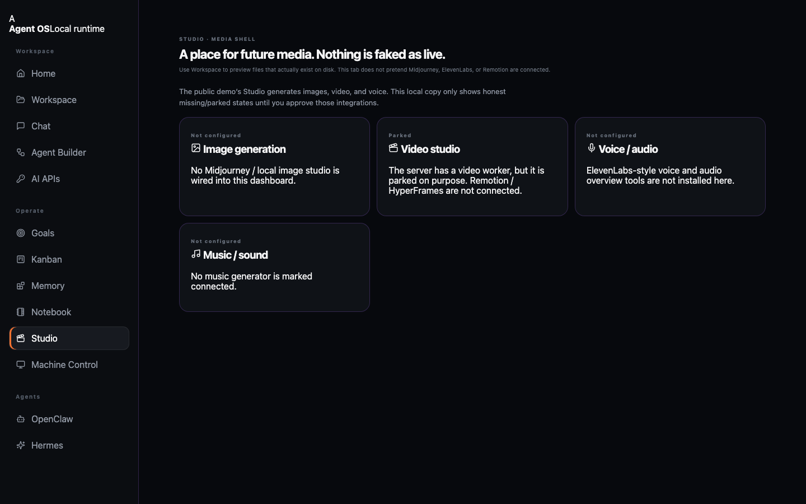
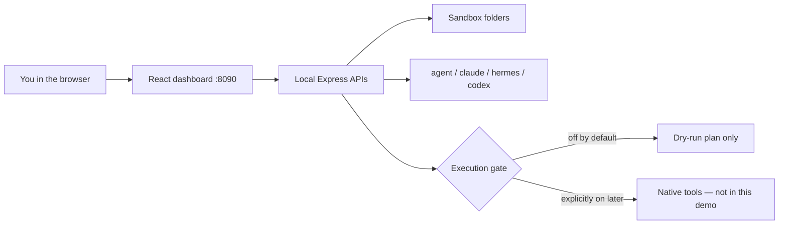

<p align="center">
  
</p>

<h1 align="center">Agent OS</h1>

<p align="center">
  <strong>A local command center for AI coding agents.</strong><br />
  One dashboard. Honest status. Dry-run by default. Execution stays off until you turn it on.
</p>

<p align="center">
  <a href="https://hharsha98.github.io/agent-os/"></a>
  <a href="#run-it-locally"></a>
  
  
</p>

<p align="center">
  <a href="https://hharsha98.github.io/agent-os/">Click through the product gallery</a>
  ·
  <a href="docs/DEMO.md">90-second recruiter tour</a>
  ·
  <a href="#what-a-recruiter-is-looking-at">What this shows</a>
</p>

---

## What a recruiter is looking at

This is not a toy chat wrapper. It is a **local-first operations dashboard** for agents that already live on a Mac: Cursor Agent, Claude Code, Codex, and Hermes.

| You see | What it proves |
| --- | --- |
| Mission Control with **4/4 local checks** | The UI reports real CLI presence — it does not paint fake “connected” cards |
| Unified Chat labeled **Dry run** | Safety is a product decision, not a comment in code |
| Workspace sandbox | File preview is jailed to `~/.hermes-agent-os/workspace` + `exports` — not the whole disk |
| Machine Control with **Run command disabled** | Computer-control stays gated (`cliclick` missing, execution off, shell off) |
| **152** automated tests | Backend behavior is checked, including path-travel rejection |

<p align="center">
  <a href="https://hharsha98.github.io/agent-os/">
    
  </a>
  <br />
  <sub>Home · Mission Control. Click for the full gallery.</sub>
</p>

---

## Product tour

<table>
  <tr>
    <td width="50%">
      <a href="docs/screenshots/chat.png"></a>
      <p><strong>Unified Chat</strong> — one box, four agents. Cursor tells the truth if chat routing is missing. Claude / Codex / Hermes stay in dry-run.</p>
    </td>
    <td width="50%">
      <a href="docs/screenshots/workspace.png"></a>
      <p><strong>Workspace</strong> — search, filter, preview HTML in a sandboxed iframe. Empty is honest until files exist.</p>
    </td>
  </tr>
  <tr>
    <td>
      <a href="docs/screenshots/machine.png"></a>
      <p><strong>Machine Control</strong> — permission checklist only. The dangerous button is disabled on purpose.</p>
    </td>
    <td>
      <a href="docs/screenshots/studio.png"></a>
      <p><strong>Studio / Goals / Kanban / Memory / Notebook</strong> — real local APIs, parked media, no fake Midjourney.</p>
    </td>
  </tr>
</table>

More stills: [Goals](docs/screenshots/goals.png) · [Kanban](docs/screenshots/kanban.png) · [Memory](docs/screenshots/memory.png)

---

## How the pieces fit



**Stack:** React 18 + TypeScript + Vite on the front. Node / Express on the back. Lucide icons. Tests with Node’s built-in test runner.

---

## Feature status (honest)

| Surface | State |
| --- | --- |
| Home / Mission Control | Live local version checks |
| Agent Builder + AI APIs | Wired (Codex preview, install guides) |
| Workspace preview | Live, sandboxed |
| Unified Chat | Dry-run for Claude / Codex / Hermes; Cursor CLI detected, chat not routed |
| Goals / Kanban / Memory / Notebook | Live local stores |
| Studio | Honest **Not configured / Parked** |
| Machine Control | Status only — no send/run |
| OpenClaw native install | Not installed on this machine; UI does not fake it |
| Overnight Goal Mode | CLI may exist; **execution stays off** |

---

## Run it locally

Needs Node 18+ on your machine. This is a **local app**, not a hosted SaaS.

```bash
git clone https://github.com/hharsha98/agent-os.git
cd agent-os
cp .env.example .env
npm ci
npm run build
PORT=8090 npm start
```

Open [http://127.0.0.1:8090](http://127.0.0.1:8090).

Hot reload while hacking:

```bash
npm run dev
```

Leave these **off** unless you later decide otherwise (they are already `0` in `.env.example`):

```bash
HERMES_AGENT_OS_ENABLE_EXEC=0
HERMES_AGENT_OS_ENABLE_INSTALL=0
HERMES_AGENT_OS_PUBLIC_MODE=0
```

`.env` is gitignored. Never commit API keys.

---

## Verify

```bash
npm run build          # typecheck + production bundle
env -u HERMES_HOME npm test
```

Last local run: **152 passed / 0 failed**, including workspace path-travel checks (`../` is rejected).

---

## Why the safety story matters

Most “agent dashboards” look impressive and then silently run shell on your laptop. This one is built the other way around:

1. Show what is actually installed.
2. Let you plan in **dry-run**.
3. Keep computer-control, installs, and public mode behind explicit flags.
4. Preview generated files only inside a sandbox.

That is the engineering judgment I want a hiring loop to notice.

---

## Repo map

```text
src/                 Dashboard (AgentOSApp + Phase 2 pages)
server/              Express APIs, workspace sandbox, memory, goals
test/                Runtime + workspace tests
docs/                Cover, screenshots, clickable gallery
.env.example         Safe defaults — copy to .env
```

---

<p align="center">
  <sub>Built as a local-first portfolio system · MIT · <a href="https://github.com/hharsha98">hharsha98</a></sub>
</p>
