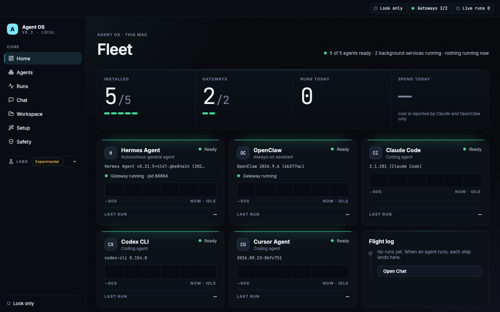
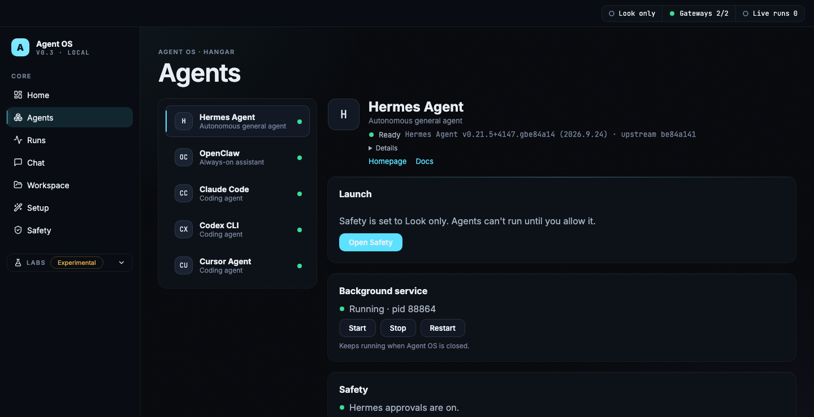
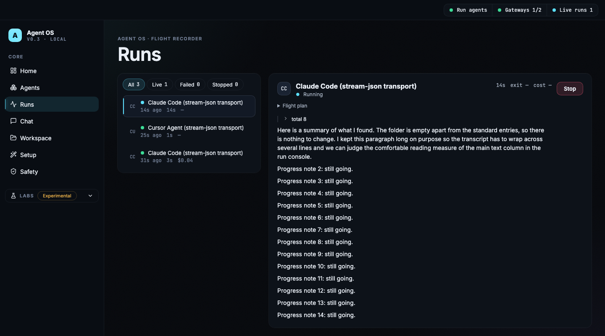
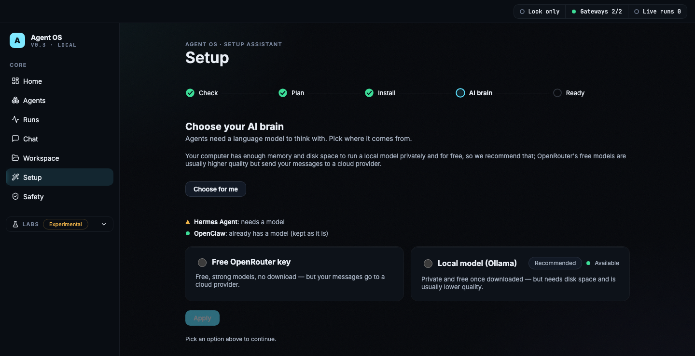
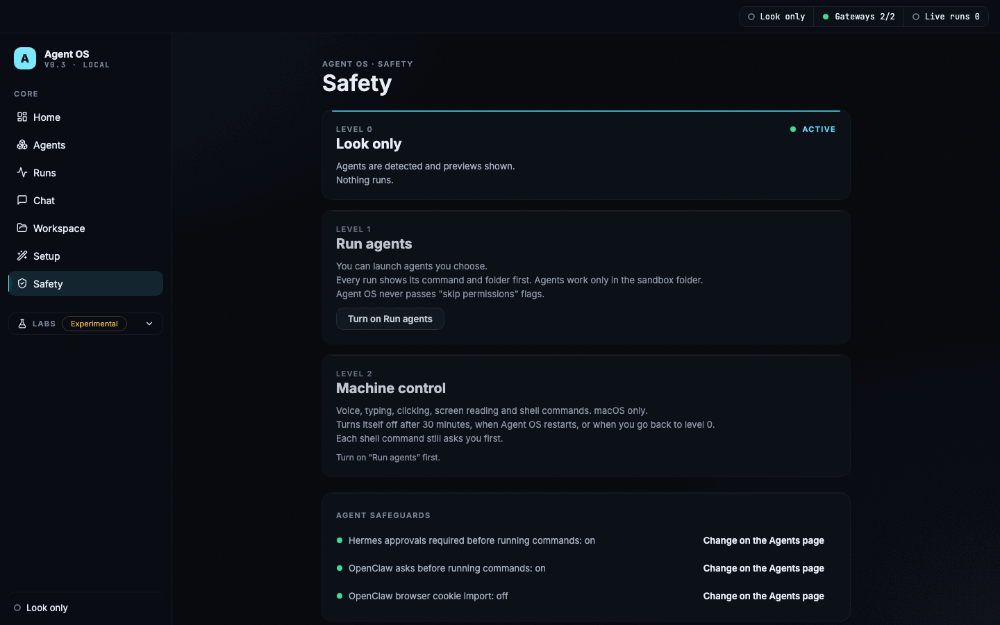

<h1 align="center">Agent OS</h1>

<p align="center">
  <strong>Agent OS is a desktop control room for AI agents: install, configure, launch, watch and stop Hermes Agent, OpenClaw, Claude Code, Codex and Cursor from one window, safely by default.</strong>
</p>

<p align="center">
  <a href="https://github.com/hharsha98/agent-os/releases/latest"></a>
  <a href="#run-from-source"></a>
  
</p>

<p align="center"><em>Version 0.3. Unsigned builds. Hand-tested on macOS (Apple silicon) only.</em></p>



<sub>Home, recorded on the author's own Mac with Safety on "Look only", so nothing is running.</sub>

---

## Download

Get the installer for your computer from the [latest release](https://github.com/hharsha98/agent-os/releases/latest). The first public version, v0.3.0, came out on 1 October 2026.

Which file is yours:

| Your computer | Download |
| --- | --- |
| Mac with an Apple chip (M1, M2, M3, M4...) | the `.dmg` with `aarch64` in its name |
| Mac with an Intel chip | the `.dmg` with `x64` in its name |
| Windows 10 or 11 | the `setup.exe` |
| Linux (Debian, Ubuntu and friends) | the `.deb` |
| Linux (anything else) | the `.AppImage` |

Not sure which Mac you have? Apple menu > About This Mac. "Chip" means Apple silicon. "Processor" means Intel.

### First launch (the builds are unsigned)

I have not paid for Apple or Microsoft developer certificates, so your computer will warn you the first time. The warning is expected.

- **macOS:** right-click the app, choose **Open**, then click **Open** again. On macOS 15 or newer it may still refuse. Then open **System Settings > Privacy & Security**, scroll down, and click **Open Anyway**.
- **Windows:** when SmartScreen says "Windows protected your PC", click **More info**, then **Run anyway**.
- **Linux:** an AppImage needs permission to run: `chmod +x Agent-OS_*.AppImage`, then double-click it or run it from a terminal.

The first time it opens, Agent OS starts a small private server on your computer. You do not need to install Node or anything else first. The **Setup Assistant** checks your computer and offers to install Hermes Agent and OpenClaw. **Nothing is installed until you click for it.**

---

## What it does

Agent OS has a sidebar with seven main pages: Home, Agents, Runs, Chat, Workspace, Setup and Safety. A collapsed **Labs** group holds older, experimental pages. The pages below are the ones built for the desktop app.

### Agents

Hermes Agent, OpenClaw, Claude Code, Codex and Cursor each get a page. It shows the detected version, whether the agent is ready, its safety settings and its configuration. For Hermes and OpenClaw you can start, stop and restart the background service. The Launch panel is locked until you raise the Safety level.



<sub>Agents, on the author's Mac.</sub>

### Runs

Every run an agent starts is recorded here: its output as it streams in, how long it ran, and a **Stop** button. The command and working folder are in a "Flight plan" you can open.



<sub>Runs, recorded with a test agent (a small fake script, not a real Claude Code), on a throwaway data folder. It shows the screen, not real agent output.</sub>

### Setup

The Setup Assistant walks through five steps: check your computer, plan, install, pick an AI model ("brain"), ready.

- It only uses the **official installers** of Hermes Agent and OpenClaw. It shows what each one will change before you click.
- An agent you already have is **kept** by default, not reinstalled.
- For the AI model you can use a free OpenRouter key or a local Ollama model you already have. Agent OS does not install Ollama.
- It does not store your OpenRouter key. It checks the key with OpenRouter, then hands it to Hermes's or OpenClaw's own setup commands. Those store it in their own config.
- It will switch OpenClaw to "ask before running commands", after you confirm.



<sub>Setup, on the author's Mac, where the earlier steps were already done.</sub>

### Safety

Three levels. A fresh install starts at level 0. [More on this below](#safety-by-default).



<sub>Safety, on the author's Mac.</sub>

### What each agent runs with

This is what Agent OS passes when you launch a run (checked in `server/runtime/agents/`):

| Agent | How a run starts |
| --- | --- |
| Claude Code | print mode with `--permission-mode dontAsk` (`acceptEdits` only if you tick "allow edits") |
| Codex | `codex exec` with a read-only sandbox (`workspace-write` only if you tick "allow edits") |
| Cursor | proposes changes only. Agent OS never lets it apply them: open Cursor to do that |
| Hermes Agent | runs through Hermes's own approval setting. Agent OS shows whether approvals are on |
| OpenClaw | runs through OpenClaw's own settings. Agent OS can switch it to "ask before running commands" |

---

## Safety by default

There are three levels. A fresh install is at level 0, "Look only". If you turn on level 1 it is remembered between launches (it is saved in a local config file), until you switch back. Level 2 is never remembered.

| Level | Name | What it means |
| --- | --- | --- |
| 0 | Look only | Agents are detected and previews are shown. **Nothing runs.** |
| 1 | Run agents | You can launch agents you choose. Each run shows its command and folder first. |
| 2 | Machine control | Voice, typing, clicking, screen reading and shell commands. **macOS only.** |

Level 2 is hard to turn on on purpose:

- You must be at level 1 first, then type the exact phrase `ENABLE MACHINE CONTROL`.
- It lives only in the server's memory. It turns itself off after 30 minutes, when Agent OS restarts, or when you go back to level 0.
- Each shell command still asks you first.
- The **Machine Control** page in Labs is status only. It has no Run command button.

What Agent OS does not do:

- **No "skip permissions" flags.** Flags like `--dangerously-skip-permissions`, `--yolo` and `--force` are rejected when you configure an agent and filtered out again before a command is launched.
- **Runs start in the sandbox folder.** Agent OS refuses any other folder. This is a working folder, not an operating-system jail: what an agent can touch is still decided by that agent's own permissions.
- **Nothing installs without a click.** Setup shows the plan first.
- **It does not store your API keys.** See Setup above.
- **The server is local only.** It listens on `127.0.0.1`, checks the `Host` and `Origin` headers, and needs a login token. The token is new on every launch. The desktop app logs you in for you. From source, `npm start` prints a one-time login link.

This is a safety design, not a guarantee. It has not had an outside security review. An agent you start at level 1 is a real program that can do real things inside its own permissions.

---

## Tested on

| Platform | State |
| --- | --- |
| macOS (Apple silicon, arm64) | Hand-tested. The v0.3.0 release installer was installed and launched on the author's Mac. |
| macOS (Intel) | Built by the release workflow. **Not hand-tested.** |
| Windows | Built by the release workflow. **Not hand-tested.** |
| Linux | Built by the release workflow. **Not hand-tested.** |

- **Unit tests:** 313 tests (`npm test`). On the author's Mac: 312 pass, 1 skipped, 0 fail.
- **CI** (`.github/workflows/ci.yml`) runs the tests on Ubuntu, macOS and Windows with Node 24, and a smoke test on Ubuntu.
- **Release workflow** (`.github/workflows/release.yml`) builds the installers for the four rows above. It built v0.3.0.

---

## Run from source

For developers. You need **Node 24** (what CI and the desktop app use; `package.json` allows 18 or newer, but only 24 is tested).

```bash
git clone https://github.com/hharsha98/agent-os.git
cd agent-os
npm install
npm run build
npm start
```

`npm start` prints a line like `Agent OS is running. Open: http://127.0.0.1:8090/?launch=...`. Open that link. It signs you in for this run of the server. A plain `http://127.0.0.1:8090` without the token will be refused for the API.

```bash
npm test                  # unit tests (use `env -u HERMES_HOME npm test` if you have HERMES_HOME set)
npm run dev               # hot reload: UI on 5173, API on 8090
npm run desktop:build     # build the desktop app (needs Rust, see below)
```

The desktop build needs [Rust](https://rustup.rs) and, on macOS, the Xcode Command Line Tools. Steps, the output folder and release instructions are in [desktop/README.md](desktop/README.md).

Settings: `PORT` changes the port (8090 by default). `HOST` changes the address (127.0.0.1 by default). The server loads `.env` at start and does not override variables already set in your shell. `.env` is gitignored: never commit keys. Copy `.env.example` if you want one. Execution flags in it stay off by default.

---

## How it works

```text
Agent OS window (Tauri 2 desktop shell)
  -> bundled Node 24 server (127.0.0.1, random port, per-launch login token)
       -> the agents' own official command-line tools
          hermes, openclaw, claude, codex, agent (Cursor)
```

The desktop app is a small native window around the same server and web UI that `npm start` gives you. It carries its own copy of Node. Your data stays in the same folder either way, so the app and `npm start` share agents, runs and settings. More detail: [desktop/README.md](desktop/README.md).

The stack: React 18, TypeScript and Vite on the front. Node and Express on the back. Node's built-in test runner. Tauri 2 for the desktop shell.

---

## Limits

- **Builds are unsigned.** Your OS will warn you on first launch (see Download).
- **Auto-update is set up but not yet proven.** Release builds carry the signing key, so the app can offer updates from the next version on. Until an update has actually gone through, expect to download the new installer if it does not.
- **Hermes Agent: Setup treats Intel Macs as unsupported** and says so instead of installing.
- **Windows and Linux have not been hand-tested.** Intel Mac builds have not either.
- **Level 2 (Machine control) works on macOS only.**
- **Team Room**, where agents work together, is **planned** for v1.1. It is not in this version.
- **Chat, Workspace and the Labs pages** are older pages. I did not re-audit them for this release, and they are not in the screenshots above.

---

## Older docs

These were written for v0.2, before the desktop app. They describe the older dashboard and may not match v0.3: [Product tour](docs/DEMO.md) · [What v1 includes](docs/V1.md) · [Setup guide](SETUP-GUIDE.md) · [Hosting](docs/HOSTING.md).

There is also a [static gallery](https://hharsha98.github.io/agent-os/) of v0.2 screenshots on GitHub Pages. It is screenshots only. It does not run anything.

---

## Optional: private self-host

Agent OS is a local app. Keep it on loopback. If you need it from another machine, use an SSH tunnel and read [docs/HOSTING.md](docs/HOSTING.md) first. Do not expose it to the public Internet. If you ever reverse-proxy it, add your hostname to `AGENT_OS_ALLOWED_HOSTS` and set up real authentication.

### Docker

Only if you already have Docker and want the server in a container:

```bash
cp .env.example .env
docker compose up --build
```

The host port is `127.0.0.1:8090`. Inside the container the server uses `HOST=0.0.0.0` so Docker can forward the port. Agent CLIs on your computer are **not** available inside the container, so it can only show them as not installed. Docker is not part of CI and was not re-tested for v0.3. Prefer `npm start`.

### Screenshot demo mode

`DEMO_PUBLIC=1` starts a sandboxed walkthrough with simulated agents, used for screenshot galleries. It is not a claim that anyone's agent is connected, and it keeps execution locked off. Do not publish that process.

```bash
DEMO_PUBLIC=1 HOST=127.0.0.1 PORT=8090 npm start
```

`npm run smoke:local`, `npm run smoke:public` and `npm run smoke:live` are older smoke scripts. CI runs the first two.

---

## Repo map

```text
src/                 Web UI (pages, Shell, components)
server/              Express server, run manager, agent adapters, setup assistant, safety gate
desktop/             Tauri desktop shell and its README
test/                Unit tests
scripts/             Build, desktop packaging and smoke scripts
docs/                Screenshots, older docs, hosting notes
.github/workflows/   CI and the release workflow
```

---

## Contact

Questions or problems: mechaharsh@gmail.com

## License

MIT. See [LICENSE](LICENSE).

---

<p align="center">
  <sub>Local-first · MIT · <a href="https://github.com/hharsha98/agent-os">hharsha98/agent-os</a></sub>
</p>
