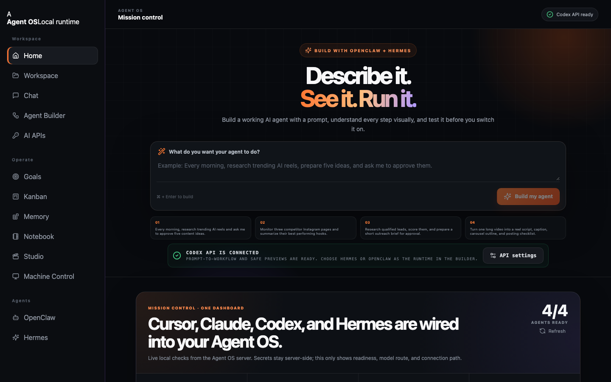
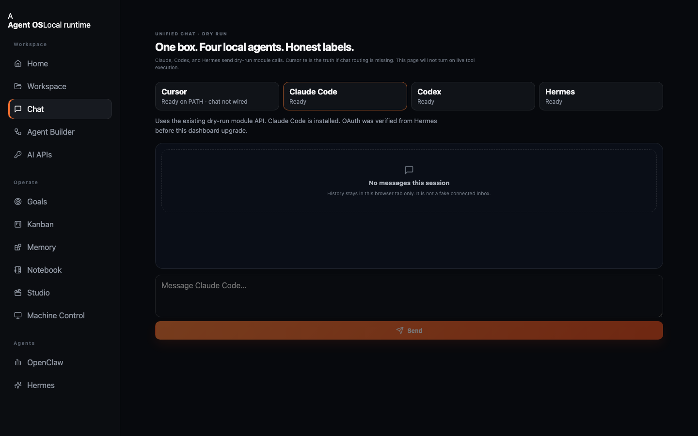
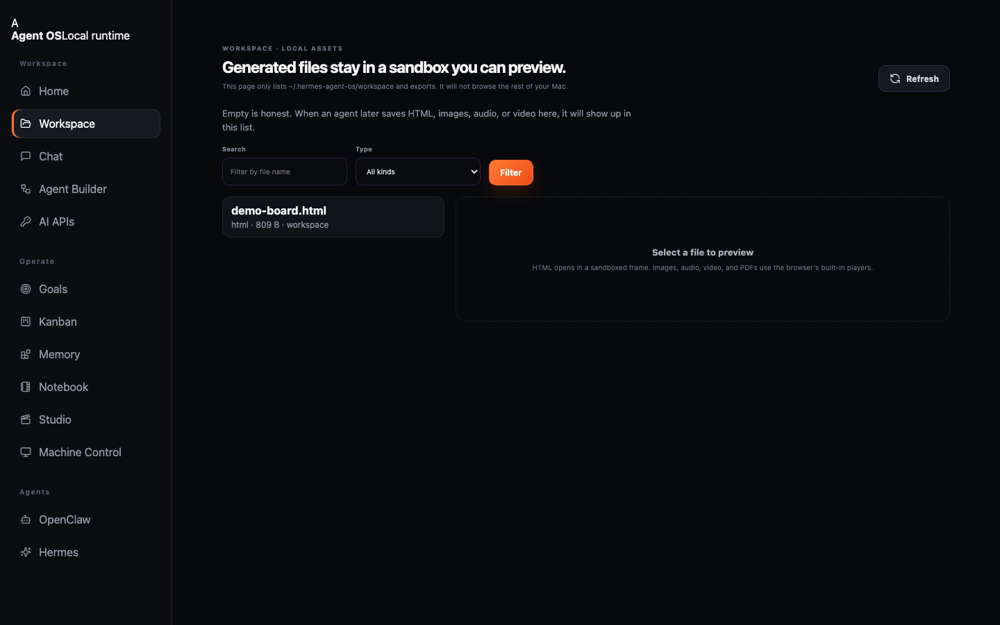
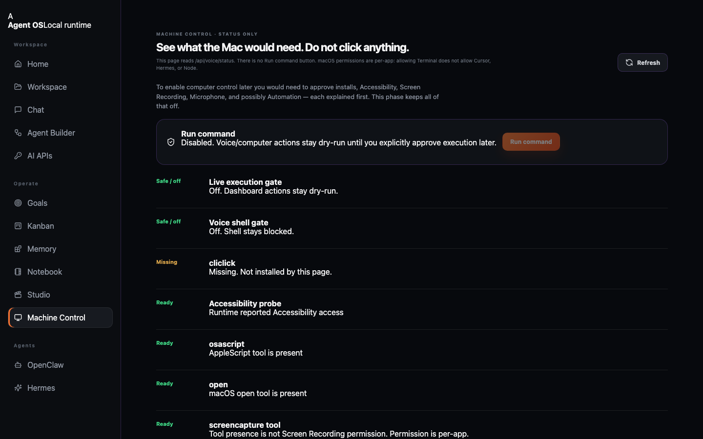

# 90-second recruiter tour

You do not need to install anything to understand this project. Use the [clickable gallery](https://hharsha98.github.io/agent-os/) or the stills below.

## 1. Mission Control (Home)



The dashboard checks **Cursor, Claude, Codex, Hermes** on the local PATH. The count is **4/4 ready** only when those CLIs actually respond. Secrets never appear in the browser.

## 2. Unified Chat



One composer, four agents. Labels are the product:

- **Dry run** — plan only, no live tools
- **Ready on PATH · chat not wired** — Cursor is installed, routing is not faked
- Session history stays in the tab — not a fake inbox

## 3. Workspace sandbox



Generated HTML/images/audio/video would land here. Listing cannot walk `../` out of `~/.hermes-agent-os/workspace` and `exports`. HTML preview uses a sandboxed iframe.

## 4. Machine Control



This page is a **permission checklist**, not a remote-control panel. `Run command` is disabled. Execution gate and voice-shell gate stay off in the default config.

## 5. Everything else

| Page | Honest empty / parked state |
| --- | --- |
| [Goals](screenshots/goals.png) | Dry-run loop only — no overnight execution claim |
| [Kanban](screenshots/kanban.png) | Real local board, empty until you add cards |
| [Memory](screenshots/memory.png) | Counts first; content after search/open |
| [Studio](screenshots/studio.png) | Midjourney / ElevenLabs / Remotion **not** connected |

## Run the real app

```bash
git clone https://github.com/hharsha98/agent-os.git
cd agent-os
cp .env.example .env
npm ci && npm run build && PORT=8090 npm start
```

Then open http://127.0.0.1:8090
