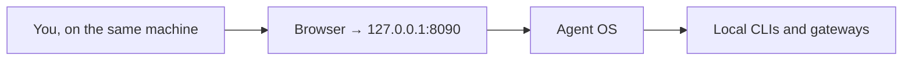
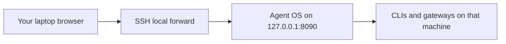

# Hosting

Agent OS is a local app. Run it on the machine that owns the agents, and open it at `http://127.0.0.1:8090`.

Public Internet exposure is discouraged. The process can run CLIs, read a workspace, and hold API keys. A public URL is not the product. **AgentOps Studio** is the hosted ops product; this app is not.

The old public Contabo Caddy site was removed. Do not recreate it.

## Recommended topology



Remote personal use keeps that same bind and adds an SSH tunnel. Strangers do not get a hostname.



## Bind

Native `npm start` listens on `127.0.0.1` unless `HOST` is set. `.env.example` sets `HOST=127.0.0.1`.

| Situation | Bind |
| --- | --- |
| Laptop or private VPS | `HOST=127.0.0.1` |
| Container, so Docker can publish a port | `HOST=0.0.0.0` inside the container only. Publish the host port on `127.0.0.1` (see `docker-compose.yml`). |

Leave port **8090** closed on any firewall. `GET /api/health` reports `bind` and `port`.

Safe flags, already the defaults:

```bash
HOST=127.0.0.1
HERMES_AGENT_OS_ENABLE_EXEC=0
HERMES_AGENT_OS_ENABLE_INSTALL=0
HERMES_AGENT_OS_PUBLIC_MODE=0
DEMO_PUBLIC=0
AGENT_OS_LIVE_CHAT=0
```

`HERMES_AGENT_OS_PUBLIC_MODE=1` is an admin lock for a process you chose to expose. It is not a product mode, and it is not multi-tenant accounts. Prefer not to expose the process at all.

## SSH tunnel

From your laptop, with the app already listening on the server loopback:

```bash
ssh -N -L 8090:127.0.0.1:8090 user@your-server
```

Then open [http://127.0.0.1:8090](http://127.0.0.1:8090) on the laptop. The server firewall does not need port 8090 open.

Use a different local port if 8090 is already taken:

```bash
ssh -N -L 18090:127.0.0.1:8090 user@your-server
```

Open `http://127.0.0.1:18090`.

For that plain-HTTP tunnel, leave `HERMES_AGENT_OS_COOKIE_SECURE=0`. A `Secure` cookie is not stored on `http://127.0.0.1`.

## Private operator unit

`deploy/agent-os-live.service` and `deploy/live.env.example` are for one owner on one machine. They are not a public gallery.

1. Build the checkout (`npm ci && npm run build`).
2. Copy `deploy/live.env.example` to a root-only file such as `/etc/agent-os/live.env` (`chmod 600`).
3. Fill secrets there. Never commit them.
4. Set `User=` / `Group=` in the unit to the account that owns `HERMES_HOME` and can reach a local OpenClaw gateway.
5. Enable the unit. Confirm `curl -s http://127.0.0.1:8090/api/health` shows `"bind": "127.0.0.1"` and `"demoPublic": false`.

`AGENT_OS_LIVE_CHAT=1` in that example turns on the owner's text lane (OmniRoute and the gateway). `HERMES_AGENT_OS_ENABLE_EXEC` stays `0` until you want native CLIs. `HERMES_AGENT_OS_REQUIRE_AUTH=1` is set because this file is the one you would use on a VPS. Put the admin token only in the server env file.

`deploy/agent-os-demo.service` is the optional screenshot gallery (`DEMO_PUBLIC=1`). Run it on loopback if you need canned seats for screenshots. Do not put it on the Internet.

## Reverse proxy

Do this only if an SSH tunnel is not enough, and only for yourself.

- Node stays on `127.0.0.1:8090`.
- The proxy is the only thing with a certificate.
- Set `HERMES_AGENT_OS_REQUIRE_AUTH=1` and a long random `HERMES_AGENT_OS_ADMIN_TOKEN`.
- Set `HERMES_AGENT_OS_COOKIE_SECURE=1` when the browser uses HTTPS.
- Leave `HERMES_AGENT_OS_PUBLIC_MODE=0` unless you also want the admin lock.
- Leave `DEMO_PUBLIC=0` if this process should call real backends. Gallery mode refuses the live lane.
- Do not open 8090 to the Internet.

`deploy/Caddyfile.example` is a commented sketch of that proxy. It is not a public site name.

Unauthenticated exposure is not supported. There is no tenant model, and the workspace is one shared sandbox.

## Checklist

- Bind is loopback (`/api/health` → `"bind": "127.0.0.1"`).
- Port 8090 is not in the public firewall.
- Execution and install flags are off unless you turned them on on purpose.
- Secrets are in an untracked env file, mode `0600` on a server.
- Remote access is an SSH tunnel, or a reverse proxy with auth.
- The static gallery at github.io is the only public page, and it does not run agents.
